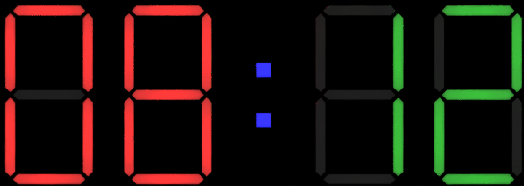

# WS2812 7-Segment Display
<b>Library to create a 7-Segment Display using WS2811b addressable LEDs

Developed and tested on MicroPython ( ESP8266 and ESP32 TTGO) </b>


For bugs and ideas of improvement feel free to open an issue!

## Version 1.0.0
---

## Dependant libraries:

- micropython builtin libraries

<br>
<br>

## Example of usage:
Controll a 2x2 7-Segment display with dots



<br>

---

## 1. Initiate the Display object by instantiating the Segments class

``` py
import segments
display = segments.Segments(NP_PIN, addrOfset=0, ledPerSegment=3, ledPerDot=1, numDisplay=4)
```
`NP_PIN [int]` is the pin-number the addressable LEDs are connected to

`addrOffset [int]` is the address of the first led of the display (normally 0 if u have no other leds in front on the data-line)

`ledPerSegment [int]` is the total count of LEDs in one single segment (default is 3 LEDs per segment)

`ledPerDot [int]` is the count of LEDs in a single Dot (default is 1 LED per dot)

`numDisplay [int]` is the count of single digit 7-segment-displays available for use (default is 4 displays)

## 2. Set the display to show your data

There are two different ways of showing your data on the Displays:

1. By writing each single digit display on its own:
   
    ``` py
    setSegment(num, value, color=(0, 0, 100))
    ```
    `num [int]` is the index of the digit you wanna set

    `value [int/char]` the value you want the display to be set to. [^1]

    `color [tuple (R, G, B)]` the color you want the value to be displayed (Default: 0, 0, 100 --> Blue) 

<br>

2. By writing each double segment

    ```py
    setDoubleSegment(self, num, value, color=(0, 0, 100))
    ```
    `num [int]` is the index of the digit you wanna set

    `value [int/char]` the value you want the display to be set to. [^2]

    `color [tuple (R, G, B)]` the color you want the value to be displayed (Default: 0, 0, 100 --> Blue) 

3. By switching the dots 

    ```py
    setDots(display, dotColor=(0, 0, 100))
    ```

    `display [bool]` is the parameter if the dots should be on (`True`) or off (`False`)

    `dotColor [tuple (R, G, B)]` is the color the dot schould be displayed


---


[^1]:
    List of available Symbols: 
    
  - Digits 0 - 9
  - Degree Symbol (°)
  - Letters `C, F, E, U, P`
  - Minus ( - )

[^2]: 
    `setDoubleSegments()` only accepts values from 0 up to 99